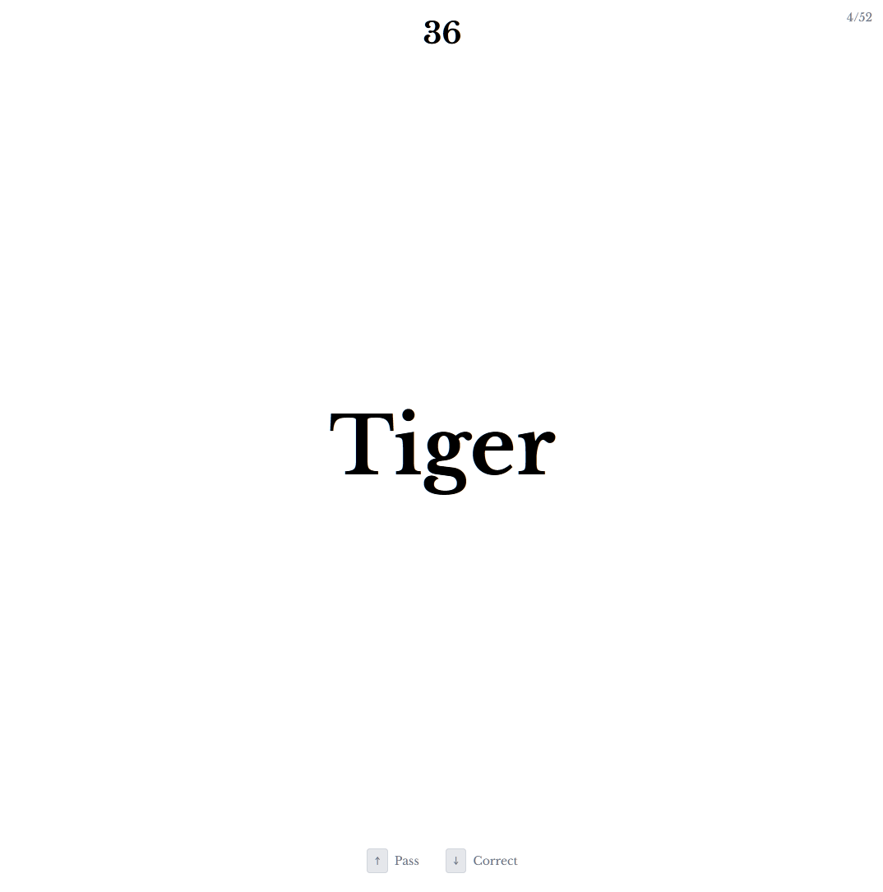
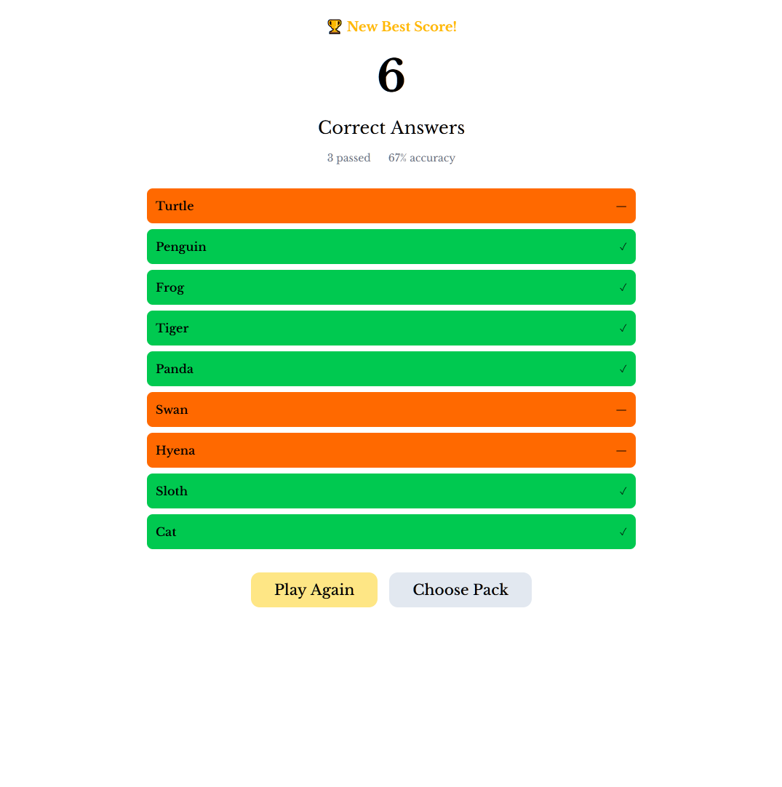

# Têtê

A heads-up style party game you can play right in your browser. Hold your phone to your forehead, tilt to answer — you know how it goes.


## What it does

Someone picks a card pack, holds the phone up, and everyone else gives clues. Tilt forward for correct, tilt back to pass. That's it, really.

- Multiple built-in packs (countries, animals, movies, etc.)
- Create your own custom packs
- Three difficulty modes — chill, normal, and hard
- Tracks your best scores
- Works offline (PWA)





## Getting started

```bash
npm install
npm run dev
```